# Write README

## Overview

A fixed, proven README structure. A reader should understand **what the repo is, why it exists, what it found, and how to rerun it** in under one minute of scrolling, without opening a single file.

**Core principles:**

- **Tables over prose.** Every section after the header is a table, a diagram, a code block, or an image. Prose is at most one sentence introducing a figure
- **Real numbers only.** Every count, rate, runtime, and threshold comes from files in the repo (output CSVs, notebook source, logs). Never invent, estimate, or round beyond what the source shows
- **Show, don't list.** Key results are embedded as PNG previews, not linked
- **Scannable at two depths.** The essentials are visible; secondary figures and style rules live in `<details>` blocks
- **One emoji per row or heading, used as a signpost.** Never decorative runs of emoji

## Workflow

### 1. Gather facts before writing

Read, do not guess:

| Source | What to extract |
|---|---|
| Existing `README.md`, `CLAUDE.md` | Purpose, conventions, prior decisions worth keeping |
| Main notebooks / scripts (`.qmd`, `.Rmd`, `.R`, `.py`) | Pipeline steps in order, methods, parameters, rationale written in prose |
| Output tables (`write/tables/**.csv`) | Sample counts, QC medians, doublet rates, runtimes, top hits |
| Output figures (`write/figures/**.pdf`) | Which 2 figures best tell the story |
| `.gitignore` | What is tracked vs local-only |
| `du -sh`, `find -size +50M` | Data volume, to justify why data is not committed |
| `DESCRIPTION`, `library()` calls, `renv.lock`, `requirements.txt` | Dependencies |
| `git remote -v`, `gh repo view` | Clone URL for the Reproducing block |

Also note **inconsistencies** found while reading (e.g. prose says `resolution = 2`, code says `0.5`). Do not paper over them in the README: omit the disputed value and report the mismatch to the user.

### 2. Render figure previews

GitHub does not render PDFs inline. Convert the chosen figures to compact PNGs:

```bash
mkdir -p docs/images
pdftoppm -png -singlefile -scale-to 1400 write/figures/<step>/<figure>.pdf docs/images/<figure>
magick docs/images/<figure>.png -strip -colors 256 PNG8:docs/images/<figure>.png
```

- Target 15 to 150 KB per image. Keep the source figure's kebab-case name
- View each PNG after rendering to confirm it is legible and not blank
- If `.gitignore` uses an ignore-everything-then-whitelist pattern, whitelist previews explicitly:

  ```gitignore
  !docs/
  !docs/images/*.png
  ```

- Choose **2 hero figures** for the main body (the result that answers "did it work?" and the most biologically interesting output). Put 3 to 6 supporting figures in the collapsible block

### 3. Write the README using the template below

Keep the section order exactly. Drop a section only if it truly has no content (e.g. no figures in a pure package repo), never reorder.

### 4. Verify before committing

- `git add -A && git status --short`: only code, docs, and previews staged; no data, renders, or secrets
- Every relative link and image path resolves (`ls` each one)
- Every number in the README traces to a file
- Mermaid block uses `<br/>` for line breaks and quotes labels containing punctuation

## Template

Section order and formatting are fixed. Replace `<placeholders>`; delete the guidance comments.

````markdown
<div align="center">

# <one emoji> <Project Title>

**<one-line subtitle: what was done to what>**


</div>

---

## 📌 At a Glance

| | |
|---|---|
| **What** | <data type and origin, one line> |
| **Why** | <the problem this repo solves, one line> |
| **Species** | <organism, with the gene naming convention that follows from it> |
| **Current cohort** | <subset analysed so far>: <n> samples, **<total> cells** |
| **Notebooks** | <format>, run in numeric order, each reading the previous step's checkpoint |
| **Outputs** | <checkpoints, figures, tables, apps> |

---

## 🗺️ Pipeline

```mermaid
flowchart LR
    A[("📦 <Input><br/><format>")] --> B["🔄 <Step><br/><key function><br/><key choice>"]
    B --> C["🔗 <Step><br/>..."]
    C --> D["📊 <Step><br/>..."]
    D --> Z[("🖥️ <Final output>")]

    classDef io fill:#e8f1fb,stroke:#276DC3,color:#0b2545
    classDef step fill:#f4f0fb,stroke:#8A2BE2,color:#2d0a4e
    class A,Z io
    class B,C,D step
```



| Step | Notebook | Status |
|:---:|---|:---:|
| 01 | [`scripts/01-<name>.qmd`](scripts/01-<name>.qmd): <comma list of what it does> | ✅ |
| 02+ | <what comes next> | 🔜 |

---

## 🧪 <Samples | Inputs> (<cohort name>)

| Sample | Cells | Median genes/cell | Median % mito | <Key per-sample metric> |
|---|---:|---:|---:|---:|
| `<sample_id>` | <n> | <n> | <n> | <n> (<pct>%) |
| **Total** | **<sum>** | | | **<sum> (<pct>%)** |

---

## 🔑 Key Design Decisions

> [!IMPORTANT]
> **<The single most important invariant, in bold.>** <One or two sentences on why it matters to anyone using the outputs.>

| Decision | Rationale |
|---|---|
| <emoji> **<Short decision>** | <Why, in one or two sentences, grounded in the data or method> |

---

## 🖼️ Results Preview

### <Hero figure 1 title: the "did it work" result>

<One sentence stating what to see.>

<p align="center">
  .png" width="85%" alt="<descriptive alt text>">
</p>

| <Comparison column> | <Metric> | <Relative metric> |
|---|---:|---:|
| ⚡ <best option> | <value> | 1× |

### <Hero figure 2 title: the most interesting output>

<One sentence stating what to see.>

<p align="center">
  .png" width="85%" alt="<descriptive alt text>">
</p>

<details>
<summary><b>📊 More figures: <comma list></b></summary>

#### <Figure title>
.png" alt="<alt text>">

</details>

---

## 📁 Repository Layout

```
<repo>/
├── 📄 README.md
├── ⚙️ .gitignore                  # <its policy in one phrase>
├── 🧭 <project>.Rproj             # <what it anchors>
├── 📓 scripts/
│   └── 01-<name>.qmd
├── 🖼️ docs/images/                # PNG previews used in this README
│
│   ── not tracked (local only) ──────────────────────────
├── read/                          # <purpose>
├── checkpoints/                   # <purpose>
└── write/
    ├── figures/<step>/            # <contents>
    └── tables/<step>/             # <contents>
```

> [!NOTE]
> Data and generated output are **never committed**. <Data volume and largest file size, and why they cannot be on GitHub.>

---

## 🚀 Reproducing

```bash
# 1. Clone
git clone git@github.com:<owner>/<repo>.git <dir>
cd <dir>

# 2. Recreate the untracked directories
mkdir -p <dirs>

# 3. Place inputs
#    <exact location and naming pattern, with one example filename>

# 4. Render
quarto render scripts/01-<name>.qmd

# 5. <Explore / next action>
<command>
```

<One sentence on how steps can be rerun in isolation, if true.>

---

## 📦 Dependencies

| Area | Packages |
|---|---|
| 🧬 <Area> | `<pkg>`, `<pkg>` |

---

## ✍️ Code Conventions

<details>
<summary>Style rules used across notebooks</summary>

- **<Rule name>**: <rule in one line>

</details>

---

<div align="center">

**<Author>** · <Lab / Group> · <Institution>

</div>
````

## Section Rules

| Section | Rules |
|---|---|
| **Header** | Centred `<div>`. H1 gets exactly one emoji. Subtitle is bold, one line. 4 to 5 shields.io badges: language, core framework with version, document format, key package, status. Status badge text states progress concretely (`step 01 complete`, not `WIP`) |
| **At a Glance** | Two-column table with empty header row (`\| \| \|`). 5 to 7 rows, bold labels. Headline number (total cells, samples) in bold |
| **Pipeline** | Mermaid `flowchart LR`. Cylinder nodes `[(" ")]` for inputs and final outputs, rectangles for steps. Each node: emoji, step name, 1 to 2 lines of the key function or choice. Always the two `classDef` styles. Follow with a Step / Notebook / Status table using ✅ and 🔜 |
| **Samples / Inputs** | Right-align numeric columns (`---:`). Thousands separators. Sample IDs in backticks. Bold **Total** row. Numbers copied from output CSVs |
| **Key Design Decisions** | Open with one `> [!IMPORTANT]` callout for the most important invariant. Then a Decision / Rationale table, 4 to 7 rows, each decision prefixed by one emoji and bolded. Rationale explains *why*, not *what* |
| **Results Preview** | Exactly 2 hero figures, each with an H3 title, one-sentence caption, centred `` with real alt text. A small comparison table may follow a hero figure. All other figures go in one `<details>` block with H4 titles |
| **Repository Layout** | Annotated tree. Emoji only on tracked items. A `── not tracked (local only) ──` divider separates tracked from local-only paths. Close with a `> [!NOTE]` stating data is not committed and why |
| **Reproducing** | One bash block with numbered comments. Real clone URL. Every command copy-pasteable |
| **Dependencies** | Area / Packages table, emoji-prefixed areas, packages in backticks. Only packages actually loaded in code |
| **Code Conventions** | Inside `<details>`. Bold rule name, colon, one line |
| **Footer** | Centred: bold author · group · institution |

## Adapting to Repo Type

The section order stays fixed; the content of three sections flexes:

| Repo type | Samples section becomes | Results Preview becomes | Reproducing becomes |
|---|---|---|---|
| **Analysis pipeline** | Samples table with QC metrics | Hero figures from `write/figures/` | Clone, place data, render |
| **R package** | Exported functions table (Function / Purpose) | Example plot output, rendered from a README example | `remotes::install_github()` + minimal usage example |
| **Tool / CLI** | Inputs and outputs table | Screenshot or example output | Install + one worked command |

## Common Mistakes

| Mistake | Fix |
|---|---|
| Paragraphs explaining the project | Move content into the At a Glance and Design Decisions tables |
| Linking PDFs instead of showing figures | Render PNG previews into `docs/images/` |
| Numbers typed from memory or rounded loosely | Copy from the output CSVs; recompute totals and percentages |
| Every figure in the main body | Two heroes; the rest in `<details>` |
| Emoji on every bullet and word | One per heading or table row |
| Tree without tracked/untracked distinction | Add the divider and the `[!NOTE]` callout |
| `git clone <repo-url>` placeholder left in | Use the real remote from `git remote -v` |
| Previews silently ignored by a whitelist `.gitignore` | Whitelist `docs/images/*.png` and confirm with `git status --short` |
| Committing data because the user said "push everything" | Respect the `.gitignore`; explain what stayed local and why |
| Publishing unpublished results to a public repo | Check repo visibility; default new research repos to private |
